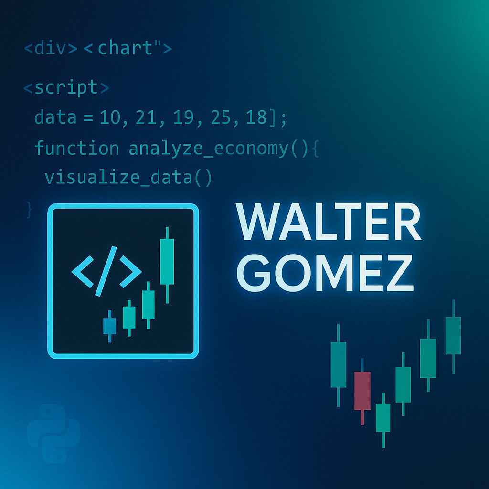

<!-- Encabezado con banner -->

  

<h1 align="center">Hola 👋, soy Walter
    
</h1>
<h3 align="center">Finance-Oriented Engineer | Fullstack Developer |  DataScience | Business Inteligence</h3>

---
###

<h3 align="center">Sobre mí</h3>

- 🎓 Apasionado por el desarrollo de soluciones tecnológicas aplicadas al mundo financiero y otros sectores.
- 💼 Experiencia construyendo aplicaciones modernas, robustas y seguras.
- 📊 Enfocado en la automatización, visualización, análisis de datos financieros, métricas de costos, ventas, presupuestos.
- 🔭 Actualmente trabajando en proyectos de DataScience, Business Inteligence, app de análsis y métricas, dashboards y simuladores de inversión. Para sectores de adminitración, finanzas, comerciales, seguros, inmobiliarios, salud y otros.

---
###  Mi Portfolio
-  

-  

-  

-  

---
<h2></h2>

### 📫 Cómo contactarme

- 

- 

-  

---
### Tecnologías que utilizo

#### Lenguajes

---

#### Frameworks & Librerías

---
#### Base de Datos

---
###  Proyectos Destacados

  * Orientados a Finanzas 
- [App Frontera de Eficiencia](https://github.com/wgekko/portfolio_management_dos)
- [App Crypto modelo Arima](https://github.com/wgekko/crypto_arima_model)
- [App Dashboard Análisis de Activos Financieros](https://github.com/wgekko/analisis_activos_financieros)
- [App Asset Dashboard Financiero](https://github.com/wgekko/asset-finance-dashboard)
- [App Métricas de Activos Financieros](https://github.com/wgekko/dashboard-finance)
- [App Análisis del Dólar](https://github.com/wgekko/analisis_dolar)
- [App Análisis Cripto Basico](https://github.com/wgekko/analisis-cripto)

  * Orientados a Automatización
- [App Presupuesto](https://github.com/wgekko/app-presupuesto-streamlit)
- [App Conciliacion Bancaria](https://github.com/wgekko/conciliacion-bancaria)
- [App Audio a Texto](https://github.com/wgekko/app-audio-texto)
- [App Prediccion de Prestamos Inmobilidario](https://github.com/wgekko/prediccion-prestamo-inmob)
- [App Prediccion de Ventas](https://github.com/wgekko/prediccion_venta)
- [App Transcribir PDF](https://github.com/wgekko/extractor-pdf)
- [App Login con JWT](https://github.com/wgekko/app_login_jwt)
- [App Login sin JWT](https://github.com/wgekko/app_login_sinjwt)
- [App Análisis de Gastos](https://github.com/wgekko/analisis_gastos)
- [App Login Reflex](https://github.com/wgekko/login_reflex)

  * React - Angular - Bun
- [Angular18  Roles](https://github.com/wgekko/angular_roles)
- [App Presupuesto](https://github.com/wgekko/apppresupuesto)
- [App E-Commerce-Angular](https://github.com/wgekko/ecommerce-angular)
- [App Transcribir BUN](https://github.com/wgekko/app-transcribir-bun)
- [App JWT - Auth](https://github.com/wgekko/login-app-mern-jwt-token-auth-otp-verification)
- [App Login JWT](https://github.com/wgekko/login_jwt)
- [App Qwik Movie](https://github.com/wgekko/app-qwik-movies)

  * Java
- [App Control de Stock](https://github.com/wgekko/Java-JDBC-Control-de-Stock)
- [App Hotel](https://github.com/wgekko/Alura_Hotel)
- [App JDBC Control de Stock](https://github.com/wgekko/Java-JDBC-Control-de-Stock)
- [App Alura E Commerce](https://github.com/wgekko/WalterGomez-ALura-Ecommerce)
- [App Biblioteca - con Spring y loguin](https://github.com/wgekko/Proyecto.Java.Spring.Loguin)
- [App Biblioteca - con Spring](https://github.com/wgekko/Proyecto-Java-Spring-Sin-Loguin)
- [App Java Incial](https://github.com/wgekko/Java-inicial)

  * Javascript
- [App Sistema de Facturación](https://github.com/wgekko/app_facturacion_javascript)
- [App Sistema de Salud](https://github.com/wgekko/JavaScript-CRUD-pacientes-clinica-salud)
- [App Sistema Solar 3d](https://github.com/wgekko/sistema_solar)
- [App Videos -swiper-slide](https://github.com/wgekko/videos_swiper_slide)
- [App Control de Gastos-efecto lluvia](https://github.com/wgekko/control-de-gastos-lluvia)
- [App Control de Gastos-animado](https://github.com/wgekko/control-de-gastos-animado)
- [App Gestor Clave- efecto con iluminacion](https://github.com/wgekko/generador_clave_iluminado)

---

  🚀 ¡Gracias por visitar mi perfil!

